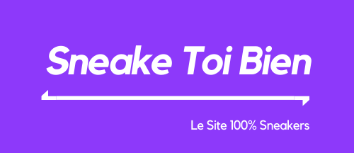

<div align="center">
  <h1>STB</h1>
</div>

<div align="center">

[](https://app.netlify.com/sites/thirsty-benz-644286/deploys) [](https://github.com/ellerbrock/open-source-badges/) [](https://github.com/yohann-kevin/STB/issues)

</div>

welcome to sneake you well the best sneaker price comparison website ever 😜.

<div align="center">
  
</div>

## Technology

* VueJS
* axios for api call
* ChartJS for visualization
* jest for spec
* deploy with Netlify

## How to install this project

in order to install the project start by cloning the repository

```shell
git clone https://github.com/yohann-kevin/STB.git 
cd STB
```

then it will be necessary to install all the dependencies

```shell
npm install
```

before you can start the project you will also have to configure the environment variable that will link the project to the Back-End in .env files

```shell
VUE_APP_API_LINK=<YOUR_API_LINK>
```

and finally start this project

```shell
npm run serve
```

to run spec

```shell
npm run spec
```

## How to contribute

Found a bug? Report it on GitHub Issues and include a code sample ! This is vitally important.

## Contributor
* me :) (PERRIGUEY Yohann)
